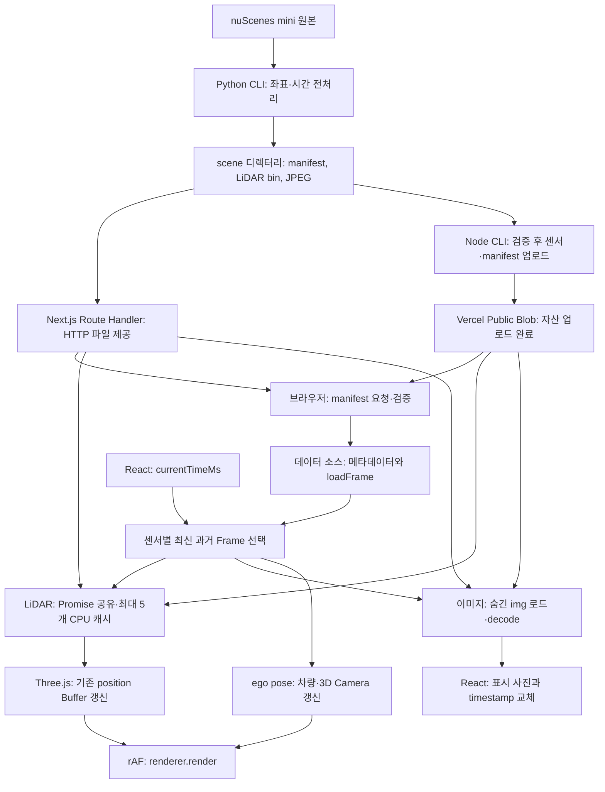
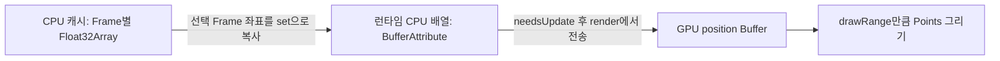

# DriveScope 아키텍처

현재 구현 기준: 2026-10-04. 설치·데모 재현은 [README](../README.md), 디스크 계약은 [DATA_FORMAT.md](./DATA_FORMAT.md), 측정 결과는 [PERFORMANCE.md](./PERFORMANCE.md)를 따른다. 구현 순서와 과거 검증은 [ROADMAP.md](./ROADMAP.md)와 [PROGRESS.md](./PROGRESS.md)에 보관한다.

## 현재 범위

DriveScope는 Next.js App Router·React·TypeScript로 UI와 재생 상태를 구성하고, Three.js의 WebGLRenderer로 3D 장면을 직접 그린다. React Three Fiber는 사용하지 않는다.

| 모드 | 현재 연결된 데이터 | 표시와 분석 |
| --- | --- | --- |
| 실제 | nuScenes mini의 LIDAR_TOP·CAM_FRONT keyframe과 ego pose | 점군, 전방 JPEG, 차량 위치·방향, 차량을 따라가는 3D Camera |
| 가상 | 0~15초 급제동 시나리오의 센서·인식·경로·차량 상태·이벤트 | 보행자 선택, 예상 경로·충돌 구간, 12.4초 급제동 이벤트 |
| 연결 중 | manifest 요청·검증 진행 | 빈 센서 상태와 연결 안내, 재생 입력 비활성화 |

상단에서 실제 센서 로그와 가상 급제동 데모를 선택한다. 기본 선택은 실제다. 실제 모드에는 객체 인식·Planning·급제동 이벤트를 아직 연결하지 않았다. 실제 센서 데이터 위에 가상 분석 결과를 섞지 않는다. 실제 manifest 연결이 실패하면 사용자의 실제 선택을 유지한 채 오류와 가상 fallback을 표시한다. 가상을 직접 선택하면 실제 manifest 요청과 연결 오류 안내 없이 가상 데이터만 사용한다.

찾아보기: [전체 흐름](#전체-데이터-흐름) · [코드와 책임](#코드와-책임) · [데이터 계약](#데이터-계약과-좌표) · [시간 선택](#재생-시계와-frame-선택) · [LiDAR](#lidar-로딩캐시buffer) · [이미지](#카메라-이미지의-준비와-교체) · [오류](#오류와-재시도) · [가상 분석](#가상-시나리오의-분석) · [cleanup](#소유권과-리소스-생명주기) · [측정과 한계](#측정-범위와-남은-작업).

## 소개 페이지와 Viewer 경계

홈(`/`)은 데이터 처리·성능 측정을 보여주는 포트폴리오다. [app/page.tsx](../app/page.tsx)는 메타데이터와 섹션을 조합하는 Server Component이고, 소개·구조·최적화·측정·영상은 [app/_components](../app/_components)의 표시 컴포넌트로 나눈다. 실제 코드를 찾아볼 수 있도록 원본 파일과 측정 문서 링크를 함께 제공한다.

새 홈에서 `"use client"`가 필요한 부분은 [frame-selection-demo.tsx](../app/_components/frame-selection-demo.tsx)뿐이다. 작은 `timeMs` state와 다섯 timestamp로 기존 `findLatestFrameAtOrBefore`를 재사용한다. Three.js·manifest 로더·센서 파일·rAF는 홈에 연결하지 않는다. Viewer 링크는 `prefetch={false}`로 조작 화면의 미리 로딩도 생략한다.

영상은 [project-demo.tsx](../app/_components/project-demo.tsx)의 네이티브 `<video controls playsInline preload="none">`이다. 별도 플레이어·React state·자동 재생을 추가하지 않는다. 포스터는 먼저 표시하고 사용자가 재생할 때 MP4를 가져온다. 실제 Chrome에서 초기 홈의 센서·MP4 요청 0개, Frame 방향키 조작·코드 Enter 펼치기·영상 재생/탐색·Viewer 왕복을 확인했다. 텍스트로 영상 흐름을 읽을 수 있는 설명도 제공한다.

홈의 밝은 색상은 [home.module.css](../app/home.module.css)의 `.home` 변수로 관리한다. `:global(html):has(.home)`은 홈이 있을 때만 루트의 `color-scheme`과 배경을 바꾼다. Viewer로 이동하면 해당 조건이 풀리고 기존 dark 설정이 적용된다. 최적화 설명은 Server Component의 세로 행으로 구성하고, 작은 화면에서는 행 안의 제목·본문도 한 열로 배치한다.

영상 자막은 [ASS 스타일 원본](../public/demo/drivescope-demo.ko.ass)을 FFmpeg로 MP4에 넣는다. 자막 위치·굵기 변경은 영상 재출력이 필요하다. 모바일의 `.video`는 `aspect-ratio: 5 / 4`, `min-height: 260px`, `object-fit: contain`으로 16:9 영상 주변에 여백을 확보한다. 소개의 Next Image 포스터는 정적 import로 파일 해시를 사용하며, 네이티브 영상·포스터 URL은 `?v=2`로 이전 미디어 캐시와 구분한다. 자세한 편집 조건은 [DEMO_SCRIPT.md](./DEMO_SCRIPT.md)를 따른다.

## 전체 데이터 흐름



Python은 개발 시 실행하는 오프라인 전처리 도구다. 브라우저 재생이나 API 요청마다 Python을 실행하지 않는다. 이미 변환한 v3 scene 전체가 있으면 Viewer 실행에 Python은 필요 없다.

로컬 서버는 `DRIVESCOPE_DATA_ROOT`가 가리키는 scene에서 파일을 읽는다. 브라우저는 `NEXT_PUBLIC_DRIVESCOPE_MANIFEST_URL`이 있으면 해당 주소를, 생략하면 `/api/drivescope-data/manifest.json`을 요청한다. 이미지·bin은 manifest 응답 URL 기준의 상대 경로로 요청한다. 개인 디스크 경로는 서버 환경에만 두며 데이터 산출물은 Git·클라이언트 bundle에 포함하지 않는다.

[upload-drivescope-data.mjs](../scripts/upload-drivescope-data.mjs)는 scene의 참조 파일을 검증한 뒤 같은 상대 경로로 Public Blob에 올리는 Node CLI다. SDK 인증 토큰은 업로드 프로세스에서만 사용한다. 방문자 브라우저는 공개 URL로 파일을 읽고 기존 로더·캐시·이미지 버퍼를 사용한다. 업로드는 배포 준비 시 실행하며 재생 루프와 별개다.

manifest를 읽으면 Frame 목록과 ego pose를 확보한다. 모든 LiDAR 바이너리와 이미지를 즉시 다운로드하지 않는다. LiDAR는 선택된 시점과 주변 시점을 요청하고, 이미지는 선택된 URL을 숨긴 img에 지정할 때 브라우저가 요청한다.

## 코드와 책임

| 코드 | 맡는 일 |
| --- | --- |
| [app/page.tsx](../app/page.tsx), [app/_components](../app/_components) | 포트폴리오 홈의 섹션·메타데이터·설계 근거·측정 결과·영상 조합 |
| [frame-selection-demo.tsx](../app/_components/frame-selection-demo.tsx) | 홈에서 작은 state로 최신 과거 Frame 선택 원리를 체험하는 Client Component |
| [lidar-frame-source.ts](../app/viewer/_data/lidar-frame-source.ts) | 로더의 Frame·세부 시간 반환 계약과 요청별 측정 타입 |
| [lidar-load-details.tsx](../app/viewer/_components/lidar-load-details.tsx) | 실제 현재 Frame과 마지막 주변 prefetch의 구간 시간 표시 |
| [convert_nuscenes_mini.py](../scripts/convert_nuscenes_mini.py) | keyframe 추출, 센서·ego 좌표 변환, 상대 시간 정규화, v3 scene 출력 |
| [Route Handler](../app/api/drivescope-data/[...assetPath]/route.ts) | 서버 파일 읽기, 허용 경로 검사, JSON·바이너리·JPEG HTTP 응답 |
| [drivescope-manifest.ts](../app/viewer/_data/drivescope-manifest.ts) | 디스크 계약·timestamp·상대 경로·pose 검증 |
| [load-drivescope-data-source.ts](../app/viewer/_data/load-drivescope-data-source.ts) | manifest로 소스 생성, 상대 URL 해석, LiDAR 요청·바이너리 해석 |
| [viewer-canvas.tsx](../app/viewer/viewer-canvas.tsx) | 선택 모드 state, key로 세션 초기화; 세션 안의 공통 시계·센서 선택·Hook 연결·패널 조합 |
| [viewer-source-selector.tsx](../app/viewer/_components/viewer-source-selector.tsx) | fieldset·radio로 실제/가상 선택 입력 표시 |
| [use-drivescope-data-source.ts](../app/viewer/_hooks/use-drivescope-data-source.ts) | enabled일 때 manifest 연결, 상태·오류·재연결과 AbortController |
| [use-playback.ts](../app/viewer/_hooks/use-playback.ts) | 재생·정지·seek, 실제 경과 시간 기반 시계 |
| [find-latest-frame-at-or-before.ts](../app/viewer/_data/find-latest-frame-at-or-before.ts) | 재생 시각 이하의 최신 Frame 선택 |
| [use-lidar-frame-cache.ts](../app/viewer/_hooks/use-lidar-frame-cache.ts), [frame-cache.ts](../app/viewer/_data/frame-cache.ts) | 진행 중 Promise 공유, 현재 Frame 로딩, 양옆 prefetch, LRU |
| [use-buffered-camera-frame.ts](../app/viewer/_hooks/use-buffered-camera-frame.ts), [camera-panel.tsx](../app/viewer/_components/camera-panel.tsx) | 이미지 준비·활성 슬롯 결정, img 표시와 지연·오류 안내 |
| [use-object-selection.ts](../app/viewer/_hooks/use-object-selection.ts) | 선택 ID state와 현재 인식 Frame의 선택 객체 파생 |
| [use-three-viewer.ts](../app/viewer/_hooks/use-three-viewer.ts) | Scene·Camera·Renderer·Buffer·Mesh·Raycaster 생성, 갱신, 렌더 루프, 정리 |
| [find-axis-aligned-trajectory-collision-segments.ts](../app/viewer/_analysis/find-axis-aligned-trajectory-collision-segments.ts) | 가상 경로와 축 정렬 footprint의 순수 충돌 구간 계산 |
| [viewer-header.tsx](../app/viewer/_components/viewer-header.tsx), [viewer-scene-panel.tsx](../app/viewer/_components/viewer-scene-panel.tsx), [_components](../app/viewer/_components) | 제목·요약·Canvas 마크업·정보·재생 입력 표시 |

`app/viewer/page.tsx`는 서버 페이지이고 `ViewerCanvas`의 `"use client"`가 브라우저 경계다. 이 경계가 import하는 Hook·표시 컴포넌트도 Client 모듈 그래프에 포함된다. Three.js의 생성과 DOM 접근은 effect 안에서 수행한다.

React가 Canvas·img DOM과 사용자 입력을 소유하고, Three.js가 Canvas의 WebGL 렌더링을 소유한다. 전방 센서 사진의 ``와 3D 시점을 정하는 `PerspectiveCamera`는 별개다. 현재 전방 사진을 Three.js Texture로 만들지 않는다.

`ViewerCanvas`는 선택 모드만 보관하고 `ViewerSession`이 기존 시계·센서·패널을 조합한다. 타이머·파일 로더·GPU 리소스 생성·패널 마크업을 직접 구현하지 않고 각 책임을 연결한다. Three.js Hook은 생성과 정리의 소유권을 한곳에서 추적하며, 순수 분석 계산은 `_analysis`에 둔다.

```tsx
const [mode, setMode] = useState<ViewerMode>("actual");
return (
  <>
    <ViewerSourceSelector mode={mode} onChange={setMode} />
    <ViewerSession key={mode} mode={mode} />
  </>
);
```

모드가 바뀌면 React는 key가 다른 세션을 새 컴포넌트로 취급한다. 이전 Hook과 Three.js cleanup 후 새 시계는 0초·정지, 선택 ID는 null, 캐시·사진 슬롯은 새 상태로 시작한다. 같은 모드를 다시 선택하거나 재생 시간만 갱신하면 key가 같아 세션을 유지한다. 선택 UI는 세션 밖에 있어 전환 중에도 키보드 focus를 유지한다.

세션은 `useDriveScopeDataSource(mode === "actual")`를 항상 호출하되 effect의 `if (!enabled) return`으로 가상 모드의 HTTP 요청을 생략한다. `mode`는 사용자의 선택이고 `sourceState`는 연결 중·실제·가상 표시 결과다. 가상 데이터 사용 조건은 `mode === "mock" || actualDataError !== null`이며, 수동 선택과 실패 fallback을 이 둘로 구분한다.

## 데이터 계약과 좌표

브라우저의 [Frame 타입](../app/viewer/_data/frame-types.ts)은 Three.js 객체를 포함하지 않는다.

| 타입 | 주요 값 | 의미 |
| --- | --- | --- |
| `LidarFrame` | `timestampMs`, `positions: Float32Array` | CPU 좌표 `[x, y, z, ...]`; 포인트 수는 배열 길이 ÷ 3 |
| `CameraFrame` | `timestampMs`, `imageUrl` | 촬영 시각과 이미지 주소; 픽셀 준비 상태는 별도로 관리 |
| `EgoPoseFrame` | `timestampMs`, `position`, `yawRadians` | 실제 차량의 기록 위치·방향 |
| `ObjectDetectionFrame` | `timestampMs`, `objects` | 가상 인식 결과의 ID·분류·confidence·박스 |
| `TrajectoryFrame` | `timestampMs`, `points` | 가상 계획 생성 시각과 미래 `offsetMs`별 예상 위치 |
| `VehicleStateFrame`, `ScenarioEvent` | pose·속도·가속도, 이벤트 시각·종류 | 가상 차량 반응과 급제동 사건 |

실제 디스크 계약은 `schemaVersion: 3`, `float32-le-xyz`, `x-right-y-up-z-backward-meters`다. manifest는 자산의 상대 경로·timestamp·포인트 수와 ego pose를 담으며, LiDAR 좌표는 별도 little-endian Float32 파일에 저장한다. 파일 크기는 `pointCount × 3 × 4`바이트여야 한다.

시간 원점은 변환 대상 Camera·LiDAR 중 가장 이른 timestamp다. microsecond 원본에서 `floor((sourceTimestampUs - timestampOriginUs) / 1000)`으로 상대 정수 밀리초를 만든다. 공간 원점은 첫 LiDAR keyframe의 ego pose다. 시간 원점과 공간 원점이 같은 센서 시각일 필요는 없다.

LiDAR의 센서 보정과 차량의 시각별 pose를 Python에서 적용한다.

```text
sensor → 현재 ego → global → 첫 LiDAR ego 기준 시나리오 → Viewer 축
scenarioFromSensor = scenarioFromGlobal × globalFromCurrentEgo × egoFromSensor
Viewer xyz = [-sourceY, sourceZ, -sourceX]
```

v3의 +X는 오른쪽, +Y는 위, +Z는 뒤이고 실제 전방은 -Z다. 이전 v2의 `[-y, z, x]`는 determinant -1인 반사였고 v3의 `[-y, z, -x]`는 +1로 오른손 좌표를 유지한다. ego 위치·yaw와 3D Camera도 같은 계약을 사용한다.

```text
yawRadians = atan2(-forwardX, -forwardZ)
Three.js에서 yaw를 적용한 전방 = [-sin(yaw), 0, -cos(yaw)]
```

변환기는 JPEG를 그대로 복사한다. 브라우저는 좌표 변환이나 사진 좌우 반전을 다시 수행하지 않는다. 기존 가상 시나리오는 +Z 전방과 고정 3D Camera를 사용한다. 로더는 v2를 거부하므로 이전 파일의 버전 숫자만 v3로 바꾸면 안 된다.

실제 3D Camera는 위 전방 벡터를 기준으로 ego 뒤 18m·위 12m에 놓이고 전방 12m·높이 1.5m를 바라본다. 점군과 Scene은 고정된 시나리오 좌표를 유지하고 Camera만 차량 pose를 따라간다. 현재 이동·yaw를 보간하거나 Camera를 smoothing하지 않는다.

## 재생 시계와 Frame 선택

서로 다른 세 시각을 구분한다.

| 시각 | 소유자 | 용도 |
| --- | --- | --- |
| `currentTimeMs` | React의 `usePlayback` | 사용자가 탐색하는 시나리오 시간 |
| `frame.timestampMs` | 센서·계획 데이터 | 해당 데이터의 기록·생성 시각 |
| `performance.now()`·rAF timestamp | 브라우저 | 재생 경과 시간·로딩 시간·FPS 측정 |

재생 중에는 100ms interval이 UI 갱신 기회를 제공하고, 실제 재생 시간은 `시작 시나리오 시간 + performance.now()의 경과 시간`으로 계산한다. 고정 `+100ms`를 누적하지 않는다. seek는 재생을 정지하고 목표 시간을 설정한다. 종료 시각은 소스의 duration으로 제한하고 끝에서 다시 재생하면 0초로 돌아간다. 실제 duration은 manifest를 따르고 가상 duration은 15초다.

Three.js rAF는 재생·정지와 별도로 계속 장면을 그린다. 재생 시각이 바뀌면 선택된 데이터에 대한 effect가 Buffer·transform을 갱신하고, rAF는 그 결과를 렌더링한다. 매 rAF마다 센서 좌표를 React state에 복사하지 않는다. 로딩 Hook의 state에는 완료된 Frame 참조와 표시 상태를 보관한다.

기본 선택은 각 센서 배열에 독립적으로 `findLatestFrameAtOrBefore(frames, currentTimeMs)`를 적용한다. 같은 배열 인덱스로 Camera·LiDAR·ego를 묶지 않는다. 미래 Frame은 목표로 선택하지 않으며 이전 Frame이 없으면 `null`이다.

실제 scene-0061의 12.4초에서는 Camera 12,050ms와 LiDAR·ego 12,085ms가 선택된다. 0초에는 Camera가 있지만 첫 LiDAR·ego는 35ms여서 해당 데이터만 비어 있다. 이는 연결 실패와 다른 상태다.

비동기 준비 때문에 **목표 Frame**과 **표시 Frame**은 잠시 다를 수 있다. [동기화 패널](../app/viewer/_components/synchronized-frames-panel.tsx)은 실제 표시 사진·로드된 LiDAR·선택된 pose의 timestamp를 사용한다. 이전 사진을 유지하며 뒤로 seek하면 사진의 시간 차이가 잠시 양수일 수도 있다. 센서별 보간이나 지연 허용 한계는 아직 적용하지 않는다.

동기화 패널은 `dd`에 시간·설명 두 줄의 최소 높이를 확보하고, 시간과 오차의 줄바꿈을 막는다. `tabular-nums`와 오차의 고정 flex 크기로 숫자 폭 변화에 따른 행 높이 변화를 줄인다. Frame 없음·로딩·정상 표시가 바뀌어도 이 공간은 유지한다.

`findNearestFrame`은 기본 재생에서 사용하지 않는다. 미래 예측 시각과 이후 관측값을 비교하는 용도로 남아 있으며, 현재 Frame 선택은 선형 탐색이다.

## LiDAR 로딩·캐시·Buffer

### 요청과 CPU 캐시

`loadDriveScopeDataSource`는 manifest를 요청·검증하고 timestamp별 메타데이터 Map과 `loadFrame(timestampMs)`를 만든다. 이 함수는 선택된 `.bin`을 fetch하고 파일 크기를 확인한 뒤 `LidarFrame`을 반환한다. little-endian 환경에서는 `new Float32Array(arrayBuffer)`로 받은 메모리를 해석하며, 다른 endian 환경에서는 `DataView`로 읽어 별도 배열을 만든다.

`useLidarFrameCache`는 소스별로 다음 두 Map을 유지한다.

| 저장소 | 내용 | 정책 |
| --- | --- | --- |
| `FrameCache<LidarFrame>` | 완료된 Frame·CPU 좌표 배열 | timestamp 키, 최대 5개, get 성공 시 최근 사용 순서 갱신 |
| `inFlightLoads` | 완료 전 로더 Promise | 같은 timestamp의 현재 요청·prefetch가 Promise 공유; 완료·실패 시 finally에서 제거 |

현재 요청이 cache hit이면 같은 Frame 참조를 즉시 반환한다. miss이면 로더를 시작하거나 진행 중 Promise를 공유한다. 현재 Frame이 준비된 뒤 양옆 한 Frame을 같은 경로로 prefetch한다. 다음 Frame을 미리 보관해도 표시 시점 선택은 재생 시간 규칙을 따른다.

목표 timestamp 변경 직후와 miss의 로딩 중에는 같은 소스의 마지막 표시 Frame을 유지한다. 성공하면 목표 Frame으로 교체하고, 현재 요청 실패·첫 Frame 이전 시각·소스 변경에는 이전 점군을 비운다. 상태와 로딩 측정은 목표 요청을 따르고, 포인트 수와 동기화 timestamp는 실제 유지 중인 점군을 따른다. 뒤로 seek하면 이전 점군의 시간 차이가 준비 중 잠깐 양수일 수 있다. 늦은 요청 완료는 기존 `ignoreResult`로 차단한다.

최대 5개는 **완료된 캐시 항목 수**의 제한이다. 진행 중 요청 수나 전체 브라우저 메모리를 5개로 제한하지 않는다. 빠른 seek 중 요청은 더 많이 남을 수 있다. 가상 모드에서는 원본 배열 전체가 이미 메모리에 있고 모의 로더가 좌표를 복사하므로 실제 데이터와 메모리·로딩 비용이 다르다.

### Three.js 표시 Buffer



`ViewerCanvas`는 실제 manifest의 최대 `pointCount × 3`을 `lidarPositionCapacity`로 전달한다. 초기화 effect는 이 값과 가상 원본의 최대 배열 길이 중 큰 용량으로 position 배열·Attribute·Geometry·Material을 만든다. 가상 모드의 최대 21포인트는 실제 모드의 용량 제한이 아니다.

Frame 변경 effect의 핵심은 다음과 같다.

```ts
(attribute.array as Float32Array).set(lidarFrame.positions);
attribute.needsUpdate = true;
geometry.setDrawRange(0, lidarFrame.positions.length / 3);
geometry.computeBoundingSphere();
```

`set()`은 캐시 좌표를 런타임 배열 앞부분에 복사한다. `needsUpdate`는 다음 render에서 GPU 전송이 필요함을 알리고, `drawRange`는 남은 용량을 그리지 않게 한다. 같은 런타임 안에서는 Frame마다 Geometry와 position 배열을 새로 만들지 않는다. Hook이 로딩 중 이전 Frame 참조를 유지하면 Buffer와 drawRange도 그대로 유지한다. 표시 Frame이 없거나 현재 요청이 실패하면 drawRange를 0으로 둔다.

`needsUpdate = true`는 Attribute의 version을 증가시킨다. CPU 배열을 바꾼 것만으로 GPU 좌표가 바뀌지 않으며 Renderer가 이 갱신을 처리해야 화면에 반영된다.

`computeBoundingSphere()`는 CPU가 position 배열을 읽어 객체의 시야 밖 판정에 쓸 구를 계산한다. drawRange와 별개로 Attribute 전체 용량을 읽으므로 뒤쪽 이전 값 때문에 구가 크게 잡힐 수 있다. 현재 구현은 이를 그대로 사용하며 계산 비용을 별도 측정하지 않았다.

## 카메라 이미지의 준비와 교체

`CameraFrame.imageUrl`은 사진 주소다. `new URL(frame.imageFile, manifestResponse.url)`은 상대 경로를 HTTP URL로 해석할 뿐 다운로드·디코딩을 완료하지 않는다. 이미지 다운로드와 JPEG·SVG 디코딩은 브라우저가 수행한다.

`CameraPanel`은 슬롯 0·1의 img DOM을 유지하고 CSS로 활성 슬롯만 표시한다. Hook은 현재 보이는 슬롯의 반대편에서 목표 사진을 준비한다.

```ts
const nextSlot = activeSlotRef.current === 0 ? 1 : 0;
const image = imageRefs.current[nextSlot];
image.src = targetFrame.imageUrl;

void image.decode().then(() => {
  if (cancelled) return;
  activeSlotRef.current = nextSlot;
  setDisplayed({ sourceId, frame: targetFrame, slot: nextSlot });
  setFailure(null);
});
```

위 코드는 성공 경로의 발췌다. 실제 구현은 빈 Frame·img 검사를 먼저 하고 decode 실패도 처리한다.

```text
목표 Frame 선택 → 숨긴 img의 src 지정 → 브라우저 다운로드·디코딩
→ decode Promise 성공 → 활성 슬롯·표시 Frame 함께 갱신 → 준비된 사진 표시
```

준비 중에는 이전 사진과 그 촬영 시각을 유지한다. `key={slot}`을 쓰므로 URL마다 DOM을 교체하지 않는다. 이 두 슬롯은 **선택된 사진의 표시 준비**를 위한 것이며 시나리오의 모든 사진이나 시간상 다음 사진을 항상 미리 읽는 기능은 아니다.

정상적인 짧은 교체에는 사진 위 loading 문구를 표시하지 않는다. 같은 표시 사진이 loading으로 500ms 유지될 때만 헤더에 `이미지 지연`을 표시한다. 타이머는 `[status, frame]`에 의존하므로 목표가 바뀌어도 같은 사진을 계속 표시하면 지연 시간을 이어간다. cleanup은 timeout을 취소하고, 지연 Frame과 현재 표시 Frame이 같은 경우에만 문구를 보여준다. 헤더 공간은 미리 확보한다. 500ms는 UI 기준이며 센서 수집 주기가 아니다.

첫 사진 준비·빈 상태·실패에는 안내를 표시한다. 소스가 바뀌거나 목표 Frame이 없으면 이전 소스 사진을 숨긴다. cleanup의 `cancelled`는 오래된 decode 완료가 현재 표시를 덮어쓰지 못하게 한다.

## 오류와 재시도

| 경계 | 실패 시 동작 | 재시도 |
| --- | --- | --- |
| manifest | HTTP·계약·timestamp 오류를 표시하고 가상 fallback | 재생 정지·0초 이동, 요청 번호 증가, manifest 재연결 |
| 현재 LiDAR | 오류 표시, 해당 점군 숨김 | 현재 시각에서 재생 정지, 같은 timestamp 요청 번호 증가 |
| 주변 LiDAR prefetch | allSettled로 처리, 현재 정상 Frame 유지 | 실패 Promise 제거 후 해당 시점 요청 시 재시도 |
| 이미지 | 이전 사진·timestamp 유지, 실패 안내 | 재생 정지, 같은 URL을 숨긴 슬롯에서 다시 로드·decode |

`requestAttempt`가 effect 의존성에 있어 번호를 증가시키면 동일 URL·timestamp에서도 다시 실행된다. 번호는 네트워크 재시도 횟수의 자동 정책이 아니라 수동 요청을 다시 실행하는 신호다.

manifest effect는 cleanup에서 AbortController를 abort하고 이후 결과도 검사한다. LiDAR의 `ignoreResult`와 이미지의 `cancelled`는 오래된 결과의 **state 반영**을 차단한다. 현재 LiDAR fetch에는 AbortSignal을 전달하지 않으므로 seek·unmount가 모든 HTTP 요청을 취소하는 것은 아니다. 늦은 LiDAR 완료는 캐시에 들어갈 수 있으나 폐기된 요청이 표시 state를 바꾸지 않는다.

LiDAR 반환 state는 소스 참조와 목표 timestamp가 모두 일치해야 사용한다. 이미지도 sourceId가 일치하는 표시 Frame만 사용한다. 실패한 Promise를 진행 중 Map에서 제거해 다음 요청이 실패 결과를 계속 공유하지 않게 한다.

Route Handler는 `manifest.json`, `lidar/*.bin`, `camera/*.jpg|jpeg`의 허용 패턴과 루트 내부 경로를 검사한다. 미설정은 503, 누락·허용되지 않은 자산은 404다. 파일 제공과 브라우저 manifest 검증은 서로 다른 경계이며 JSON·바이너리·JPEG에 각각 올바른 Content-Type을 사용한다. 현재 Route 응답과 manifest·LiDAR fetch는 no-store다.

## 가상 시나리오의 분석

가상 모드는 인식 Frame에서 보행자를 고르고 기존 박스 Mesh의 위치·크기·yaw·visible을 갱신한다. 차량 박스와 예상 경로도 최신 과거 Frame을 반영한다. 위치·yaw를 Frame 사이에서 보간하지 않는다.

예상 경로의 각 점은 공통 시나리오 좌표의 위치와 미래 `offsetMs`를 가진다. 예상 시각은 `TrajectoryFrame.timestampMs + offsetMs`다. 서로 다른 계획 Frame을 보간하면 실제 출력되지 않은 중간 계획을 만들 수 있어 현재는 기록된 계획을 그대로 교체한다.

충돌 계산은 yaw 0인 차량·정지한 보행자의 XZ footprint에 한정한다. 보행자 영역을 차량 반폭·반길이만큼 확장한 뒤, 차량 중심 경로 선분이 그 영역과 겹치는 부분을 slab clipping으로 구한다. 양 끝점이 영역 밖이어도 중간을 통과하는 선분을 찾는다. 12.0초 계획의 Z `16 → 20` 중 `17.45 → 20`이 위험 구간이고 12.4초 새 계획은 Z 15.6에서 끝나 겹치지 않는다.

노란 경로는 Line, 빨간 충돌 구간은 LineSegments의 별도 재사용 Buffer로 그린다. Grid와의 깊이 충돌을 줄이기 위해 렌더 좌표의 Y만 각각 0.05m·0.07m 올리고 원본 데이터는 바꾸지 않는다. 회전 박스·움직이는 객체의 미래 예측과 연속 충돌 판정은 구현하지 않았다.

객체 선택은 CSS Canvas 좌표를 NDC `[-1, 1]`로 바꾸고 DOM과 WebGL의 Y 방향 차이를 뒤집어 Raycaster로 검사한다. click handler는 보이는 보행자만 검사하고 Mesh의 최신 `userData.objectId`를 읽는다. wireframe 박스도 삼각형 면을 선택 영역으로 사용한다.

React state는 선택 객체의 ID를 저장하고 최신 Detection Frame에서 객체 정보를 파생한다. ID가 사라지거나 빈 공간을 클릭하면 해제한다. Three.js는 선택 피드백으로 기존 Material 색을 바꾸며 새 Material을 만들지 않는다.

## 소유권과 리소스 생명주기

| 대상 | 소유자 | 정리 |
| --- | --- | --- |
| Canvas·img DOM, 패널·선택 ID·표시 상태 | React | 컴포넌트 해제; 비동기 effect 완료 결과 차단 |
| 재생 interval | usePlayback | 정지·effect 교체·해제 시 clearInterval |
| manifest 요청 | useDriveScopeDataSource | effect 교체·해제 시 abort |
| CPU Frame 캐시·진행 중 Promise Map | useLidarFrameCache | 소스별 새 저장소; 이전 캐시 clear, Promise는 settle 후 제거 |
| 이미지 준비·지연 timeout | 이미지 Hook·CameraPanel | decode 결과 차단·clearTimeout |
| Scene·Camera·Renderer·Grid·Geometry·Material·rAF·리스너 | useThreeViewer | 런타임 effect cleanup |

Three.js 초기화 effect의 실제 의존성은 `[canvasRef, lidarPositionCapacity, scenario, setSelectedObjectId]`다. 재생 시간·FPS state 갱신만으로 런타임을 다시 만들지 않는다. manifest 연결 등으로 용량이 바뀌거나 선택 모드의 key가 바뀌어 세션을 교체하면 기존 런타임을 정리하고 새로 생성한다. 따라서 “앱 전체에서 한 번 생성”보다 “같은 용량의 런타임 동안 재사용”이 정확하다.

cleanup은 rAF와 resize·Canvas click listener를 먼저 중지하고 ref를 비운 뒤, 생성한 Geometry·Material·Grid·Renderer를 정리한다. 차량과 보행자가 공유하는 BoxGeometry는 한 번만 dispose한다.

```ts
window.cancelAnimationFrame(animationFrameId);
window.removeEventListener("resize", handleResize);
canvas.removeEventListener("click", handleCanvasClick);
// ref 해제, 소유한 Geometry·Material 각각 dispose, grid.dispose()
scene.clear();
renderer.dispose();
```

JS GC는 도달할 수 없는 객체 메모리를 나중에 회수한다. rAF 큐·이벤트 리스너가 closure를 참조하면 런타임도 계속 살아 있을 수 있다. `scene.clear()`는 부모·자식 참조를 끊고 `dispose()`는 GPU 리소스 해제를 요청한다. Renderer dispose가 사용자 Geometry·Material을 대신 정리하지 않으므로 각각 해제한다. 현재 별도 Texture는 만들지 않으며 이후 추가하면 생성한 소유자가 dispose해야 한다.

## 측정 범위와 남은 작업

| 지표 | 현재 측정 범위 | 해석 |
| --- | --- | --- |
| FPS | rAF render 횟수 ÷ 실제 경과 시간, 약 1초마다 React 표시 | render 호출 빈도; GPU 개별 작업 시간은 미측정 |
| Frame 로딩 ms | 로더 Promise 시작부터 완료까지의 경과 시간 | 실제는 HTTP·서버 파일 읽기·응답·바이너리 해석 포함 |
| 응답 헤더까지 | `fetch` 직전부터 Response 획득까지 | 서버·네트워크·브라우저 대기 포함; 서버 파일 읽기만 분리하지 않음 |
| 응답 본문 읽기 | Response 획득부터 `arrayBuffer()` 완료까지 | 남은 다운로드와 ArrayBuffer 준비 포함 |
| 좌표 배열 준비 | 본문 완료부터 크기 검사·좌표 해석 완료까지 | little-endian은 Float32Array view; GPU Buffer 복사와 업로드 제외 |
| cache hit | 로더 호출 생략, 같은 Frame 반환 | 현재 요청의 로딩 시간은 `캐시로 생략` |
| 포인트·캐시 수 | 표시 Frame의 배열 길이 ÷ 3, 완료 항목 수/5 | 장치 전체 메모리·진행 중 요청 수는 미표시 |

진행 중 Promise를 공유하면 로딩 ms는 그 요청의 최초 시작부터 계산된다. prefetch 완료는 현재 표시 로딩 시간을 바꾸지 않는다. 실제 13.9ms는 기존 비교의 miss 중앙값으로, 순수 렌더링 시간이나 메인 스레드 정지 시간이 아니다.

실제 `loadFrame`은 `{ frame, timings }`를 반환하고, 캐시에는 `frame`만 저장한다. Hook은 새 로더를 실행할 때 `requestKind: current | prefetch`와 시작 시각을 기록한다. 공유 중인 Promise를 반환할 때 종류·시작 시각도 그대로 재사용하므로 현재 선택이 이미 진행 중인 prefetch를 기다리면 `prefetch`로 남는다. 가상 로더에는 HTTP 구간이 없어 `timings: null`이며 가상의 전체 시간만 유지한다.

실제 Viewer의 세부 시간은 기본 접힌 details에서 표시한다. 현재 목표에 맞는 성공 측정 하나와 마지막 완료 주변 묶음 최대 두 개만 보관한다. cache hit·새 로딩·실패·retry에서는 현재 측정을 지워 과거 수치를 새 결과로 보여주지 않는다. prefetch는 `allSettled`로 성공 결과만 기록하며 이전 목표의 늦은 완료는 현재 표시를 덮어쓰지 못한다. unmount·소스 변경 시 기존 세션 기록을 이어 쓰지 않는다. 센서 배열·GPU 리소스를 측정용 state에 추가하지 않는다.

[benchmark-viewer.mjs](../scripts/benchmark-viewer.mjs)는 Node.js에서 Chrome DevTools Protocol로 production Viewer를 조작하고 DOM의 기존 지표를 읽어 결과 JSON을 저장한다. 화면 픽셀·OCR로 시간을 추정하지 않는다. FPS는 2.2초 준비 후 1초 간격 10회, 가상·실제 각 3회 기준선을 측정했다. 조건·한계·재실행 명령은 PERFORMANCE 문서에 둔다.

웹앱은 Vercel에 배포되어 있으며 Public Blob의 실제 scene 파일 79개는 원본 SHA-256·응답 형식·CORS를 검증했다. Config로 설정한 공개 manifest URL을 배포 Viewer가 직접 요청하고 재생·탐색·사진 유지·오류 복구·모바일 표시까지 통과했다. 실제/가상 선택 UI의 공개 반영 뒤 양방향 전환·초기화·오래된 완료 차단·retry·키보드·320/390px 표시도 검사했다. 기존 로컬 API는 미설정 503이지만 공개 모드에서는 요청하지 않는다. 배포 앱은 PC 데이터 디렉터리나 업로드 토큰을 필요로 하지 않는다. 계정의 빌드 로그·Preview 배포와 실제 모바일 기기는 별도 검증이며 1분 영상은 남아 있다. 자세한 결과는 [DEPLOYMENT.md](./DEPLOYMENT.md)에 기록한다.

ego pose 보간·Camera smoothing, 센서 sweeps 재생·누적, 실제 annotation·Planning 연결은 현재 범위 밖이다. 실제 모드의 차량 박스 크기는 현재 가상 시나리오 값을 재사용한다. Worker와 Frame 선택의 cursor·이진 탐색, 세부 시간·P95·메인 스레드 정지 측정은 로드맵의 후속 개선으로 남긴다. 측정하지 않은 병목을 근거로 복잡한 계층을 먼저 추가하지 않는다.
