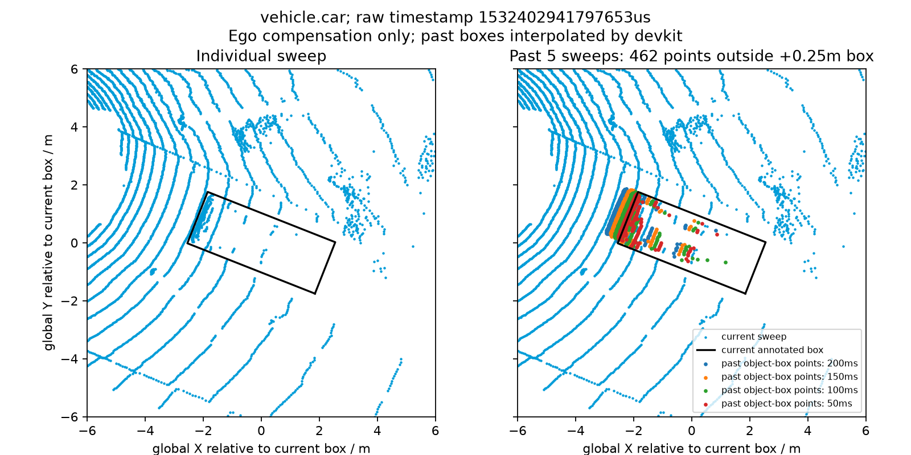

# DriveScope 가상·실제 데이터 성능 비교

측정일: 2026-10-03 21:53 KST

Viewer 기준 commit: `e546c3a` — 실제 데이터 오류 안내와 재시도까지 구현된 상태.

## 결과

같은 브라우저·화면 크기·탐색 순서로 가상 급제동 시나리오와 실제 nuScenes mini `scene-0061`을 각 3회 측정했다.

| 항목 | 가상 시나리오 | 실제 scene-0061 |
| --- | ---: | ---: |
| 탐색한 Frame의 포인트 수 | 15~21개 | 34,688~34,752개 |
| cache miss 로딩 시간 중앙값 | 0.3ms | 13.9ms |
| cache miss 로딩 시간 최소~최대 | 0.2~0.5ms | 8.9~32.8ms |
| cache miss 측정 개수 | 15개 | 15개 |
| 재생 중 표시 FPS 중앙값 | 75 | 75 |
| 재생 중 표시 FPS 최소~최대 | 75~75 | 75~75 |
| FPS 관측 개수 | 30개 | 30개 |
| 직전 Frame의 cache hit·로더 생략 확인 | 3/3회 | 3/3회 |

측정 중 LRU 캐시는 최대 5개를 유지했고 브라우저 런타임 예외는 0개였다. 실제 포인트 수는 manifest의 해당 Frame과 일치했다.

## 측정 환경과 순서

- Windows x64 `10.0.26100`, Node.js `24.19.0`, Next.js `16.3.3` production 서버.
- Headless Chrome `154.0.0.0`, 브라우저가 보고한 논리 프로세서 수 12개.
- WebGL renderer: ANGLE · NVIDIA GeForce GTX 1050 Ti · Direct3D11. 이번 실행은 실제 그래픽 장치를 사용했으며 다른 환경에서는 소프트웨어 렌더러가 선택될 수 있으므로 출력 값을 확인한다.
- viewport `1440×1400`, device scale factor 1. 기록된 Canvas drawing buffer는 `990×720`이었다.
- HTTP 캐시는 끄고 기존 LiDAR CPU LRU 캐시와 prefetch는 그대로 사용했다. 운영체제 파일 캐시는 초기화하지 않았다.
- 매 측정마다 Viewer를 새로 탐색해 React Hook의 CPU 캐시를 새로 시작했다. 실행 순서는 가상→실제, 실제→가상, 가상→실제였다.
- 두 시나리오에 공통으로 존재하는 `1,000 → 5,000 → 10,000 → 12,400 → 14,500ms`를 탐색했다. 각 결과가 cache miss인지 확인하고 현재 Frame의 로더 실행 시간을 읽었다.
- 마지막 Frame의 인접 Frame을 방문한 뒤 마지막 시점으로 돌아가 cache hit와 `캐시로 생략` 표시를 확인했다.
- 0초로 돌아가 2.2초 준비 시간을 둔 뒤 재생했다. 약 10초 동안 1초마다 기존 FPS 표시를 읽어 모드당 총 30개 값을 얻었다.
- 측정 스크립트는 기존 UI 값을 읽는다. 센서 데이터나 측정용 매 프레임 값을 React state에 추가하지 않는다.
- 가상 모드는 측정 브라우저의 manifest 응답만 404로 바꿔 기존 fallback을 사용한다. 서버 설정과 실제 데이터 파일은 수정하지 않는다.

## 로딩 시간의 의미

`useLidarFrameCache`가 새 `source.loadFrame()`을 호출하기 직전의 `performance.now()`와 Promise가 완료된 시각의 차이다.

```ts
const loadStartedAt = performance.now();
const load = source.loadFrame(timestampMs).then((frame) => ({
  frame,
  loadDurationMs: performance.now() - loadStartedAt,
}));
```

위 코드는 측정 구간만 보여주는 발췌이며 실제 Hook에서는 캐시 저장과 진행 중 요청 Map 정리도 수행한다. 현재 Frame을 위해 새로 실행된 cache miss 결과만 이 비교에 포함했다. 주변 prefetch 측정값과 cache hit는 로딩 시간 통계에 넣지 않았다. UI가 소수점 둘째 자리까지 표시한 값을 수집했으므로 그보다 세밀한 값을 해석하지 않는다.

가상 로더는 이미 메모리에 있는 원본 검색과 작은 `Float32Array` 복사를 포함한다. 실제 로더는 HTTP 요청, 서버 파일 읽기, 응답 수신, 바이너리 크기 검사와 `Float32Array` 해석을 포함한다. 따라서 두 값은 현재 데이터 소스가 화면에 제공되는 비용의 비교이며, 동일한 크기의 배열 파싱 속도 비교가 아니다.

Promise가 끝날 때까지의 경과 시간에는 비동기 대기도 들어간다. 실제 중앙값 13.9ms를 메인 스레드가 13.9ms 동안 멈췄다는 뜻으로 해석하지 않는다. 이 구간에는 React 화면 반영, Three.js Buffer 복사·GPU 업로드, 이미지 다운로드·디코딩·표시가 포함되지 않는다.

## FPS의 의미와 한계

FPS는 Three.js Hook이 약 1초 동안 호출한 `renderer.render()` 횟수를 경과 시간으로 나눈 뒤 반올림한 값이다. 이번 스크립트는 그 기존 UI 값을 1초 간격으로 관측했으므로 서로 독립적인 GPU 성능 표본이나 정확한 프레임별 소요 시간을 측정한 것은 아니다.

이번 실행에서는 두 모드 모두 표시 FPS가 75에 머물렀다. 브라우저 rAF 실행 주기에 제한됐을 가능성이 있으며, 이 값만으로 두 모드의 CPU·GPU 비용이나 남은 처리 여유가 같다고 결론낼 수 없다. 현재 환경·약 10초 재생 구간에서 FPS 저하를 관찰하지 않았다는 결과로 사용한다.

가상 모드에는 가상 객체·경로·SVG 사진이 있고 실제 모드에는 실제 점군·ego pose·JPEG 사진이 있다. 이번 비교는 각 모드의 현재 Viewer 전체 부하를 측정했으며, 포인트 수만 바꾼 실험이나 Buffer 재사용 전후 비교는 아니다.

3회·15개 cache miss의 초기 기준선이다. 장시간 메모리 변화, 원격 네트워크, 다른 장치, 정확한 CPU 정지·GPU 시간과 Worker 효과는 검증하지 않았다. 이번 수치로 Worker 도입 여부를 결정하지 않으며, 배포 후 계획한 파일 읽기·파싱 시간 분리와 메인 스레드 정지 측정에서 다시 판단한다.

## 개별 cache miss 기록

열의 순서는 목표 재생 시각이다. 단위는 ms다.

| 회차·모드 | 1.0초 | 5.0초 | 10.0초 | 12.4초 | 14.5초 | 회차 중앙값 |
| --- | ---: | ---: | ---: | ---: | ---: | ---: |
| 1 · 가상 | 0.4 | 0.5 | 0.4 | 0.3 | 0.3 | 0.4 |
| 1 · 실제 | 17.2 | 15.5 | 17.1 | 15.4 | 13.9 | 15.5 |
| 2 · 실제 | 15.6 | 11.1 | 9.7 | 12.1 | 10.9 | 11.1 |
| 2 · 가상 | 0.3 | 0.3 | 0.4 | 0.3 | 0.5 | 0.3 |
| 3 · 가상 | 0.3 | 0.2 | 0.5 | 0.2 | 0.5 | 0.3 |
| 3 · 실제 | 19.4 | 13.4 | 8.9 | 32.8 | 12.7 | 13.4 |

| 목표 재생 시각 | 가상 포인트 수 | 실제 포인트 수 |
| --- | ---: | ---: |
| 1.0초 | 15 | 34,720 |
| 5.0초 | 15 | 34,688 |
| 10.0초 | 21 | 34,688 |
| 12.4초 | 21 | 34,752 |
| 14.5초 | 21 | 34,752 |

## 다시 실행하기

v3 산출물과 `.env.local`의 데이터 연결을 준비한다. 첫 번째 터미널에서:

```powershell
pnpm.cmd validate:manifest
pnpm.cmd build
pnpm.cmd start --port 3100
```

다른 터미널에서:

```powershell
$env:DRIVESCOPE_BENCHMARK_URL = 'http://localhost:3100'
pnpm.cmd benchmark:viewer
```

기본 URL은 `http://localhost:3000`이다. Chrome이 기본 설치 위치에 없으면 `DRIVESCOPE_BENCHMARK_CHROME`에 설치된 Chromium 계열 브라우저 실행 파일을 지정한다.

스크립트는 콘솔에 회차별 결과와 요약을 출력하고 `node_modules/.cache/drivescope-benchmark/latest.json`에 개별 FPS·로딩 시간과 실행 환경을 저장한다. 임시 브라우저 프로필도 같은 Git 제외 캐시에 남는다. 공유 기준선은 이 문서이며 두 컴퓨터의 개인 데이터 경로나 브라우저 프로필을 Git에 넣지 않는다.

## 후속 계측: 로더 구간과 요청 주체

측정일: 2026-10-04 23:25 KST. 작업 시작 commit은 `bba2d88`이며 그 위에 아래 구간 계측을 추가한 production build를 사용했다. 앞의 2026-10-03 기준선과 홈의 **13.9ms는 그대로 유지**한다. 아래 값은 새 계측 실행의 관측이며 최적화 전후 향상률이 아니다. [원본 JSON](./benchmarks/lidar-load-timings-2026-10-04.json)에 실행 환경·개별 요청·구간·FPS를 보관한다.

### 측정 위치

[실제 로더](../app/viewer/_data/load-drivescope-data-source.ts)에서 네 시각을 기록한다.

```ts
const requestStartedAt = performance.now();
const response = await fetch(url, { cache: "no-store" });
const headersReceivedAt = performance.now();
const buffer = await response.arrayBuffer();
const bodyReadAt = performance.now();
// 파일 크기 검사 → 좌표 배열 해석
const positionsPreparedAt = performance.now();
```

위 코드는 측정 위치를 설명하는 발췌다. 실제 구현은 HTTP 실패와 크기 불일치를 검사한다. 로더는 `{ frame, timings }`를 반환하고 [캐시 Hook](../app/viewer/_hooks/use-lidar-frame-cache.ts)은 Frame만 캐시에 넣으며 기존 전체 시간도 기록한다.

| 구간 | 계산 | 포함하는 비용 |
| --- | --- | --- |
| 응답 헤더까지 | headersReceivedAt − requestStartedAt | 서버 처리·네트워크·브라우저 대기, fetch Promise 재개 |
| 응답 본문 읽기 | bodyReadAt − headersReceivedAt | HTTP 상태 확인, 남은 다운로드·ArrayBuffer 준비·Promise 재개 |
| 좌표 배열 준비 | positionsPreparedAt − bodyReadAt | 파일 크기 검사와 endian별 좌표 해석 |
| 전체 로딩 | Hook 로더 시작부터 완료 callback의 캐시 저장 뒤까지 | 위 구간과 metadata/URL 준비·캐시 저장·Promise 처리 등 |

브라우저 계측이므로 **서버 디스크 읽기만의 시간은 분리하지 않는다**. 응답 헤더 완료 뒤에도 다운로드가 진행될 수 있다. 이 모든 지표는 GPU Buffer 복사·업로드·GPU 실행·React 표시·JPEG 처리 시간을 포함하지 않는다. 비동기 구간의 경과 시간을 메인 스레드 정지 시간으로 해석하지 않는다.

### 현재 요청과 prefetch

새 HTTP 로딩을 만드는 순간 `requestKind: current | prefetch`와 `startedAtMs`를 기록한다. 현재 선택이 진행 중인 prefetch를 공유하면 새 요청을 만들지 않고 **최초 prefetch의 종류·시작 시각**을 유지한다. 따라서 공유 결과의 전체 시간은 사용자가 해당 Frame을 선택한 뒤 기다린 시간과 다를 수 있다. 새 현재 요청의 통계에는 `requestKind === current`만 포함한다.

cache hit는 로더 호출을 생략하고 현재 세부 값을 지운다. prefetch 완료는 현재 성공 측정값을 바꾸지 않는다. 실패한 로딩의 구간은 성공 표본에 포함하지 않는다. UI는 기본 접힌 [세부 표시](../app/viewer/_components/lidar-load-details.tsx)에 현재 성공 결과 하나와 마지막 완료 주변 묶음 최대 두 개만 보관한다. 전체 이력을 React state에 누적하지 않는다.

### 이번 실행 결과

Windows·Node 24.19.0·Chrome 154·GTX 1050 Ti·1440×1400·HTTP 캐시 비활성·LRU 최대 5개는 기존과 같은 조건이다. 가상/실제 각 3회와 다섯 탐색 시각도 유지했다. 기능 검증 Chrome을 종료한 뒤 벤치마크를 단독 실행했다. 실제는 각 현재 요청 뒤 양옆 prefetch의 완료도 확인하고 별도로 수집한다. 이 기다림은 다음 seek 간격을 바꾸므로 이전 기준선과 엄밀한 전후 비교로 사용하지 않는다. OS 파일 캐시는 초기화하지 않았다.

| 구간 / ms | 현재 요청 15개 중앙값 | 최소~최대 | prefetch 30개 중앙값 | 최소~최대 |
| --- | ---: | ---: | ---: | ---: |
| 응답 헤더까지 | 11.20 | 9.30~65.80 | 11.75 | 8.20~17.00 |
| 응답 본문 읽기 | 2.50 | 1.40~16.60 | 1.70 | 1.10~17.10 |
| 좌표 배열 준비 | 0.00 | 0.00~0.10 | 0.00 | 0.00~0.10 |
| 전체 로딩 | 15.00 | 12.40~69.50 | 14.00 | 9.70~29.20 |

각 행의 중앙값은 별개 표본 정렬 결과이므로 중앙값들을 더해 전체 중앙값과 비교하지 않는다. 원본 JS number는 JSON에 보존하고 표·UI는 소수점 둘째 자리로 표시한다. 브라우저 clock 해상도·반올림에 따라 `0.00ms`가 나오며 실제 비용이 없다는 뜻은 아니다. 현재 little-endian 경로는 좌표를 순회해 변환하거나 복사하지 않고 Float32Array view를 만든다.

이번 표본에서는 좌표 배열 준비보다 응답 헤더·본문 구간이 컸다. 서버·네트워크·브라우저 중 어느 것이 병목인지는 이 값만으로 분리할 수 없다. 평균·P95·메인 스레드 정지·Worker 효과는 이번 단계에서 측정하지 않았다. 가상 로더의 HTTP 구간은 `null`이고 전체 로딩 중앙값은 0.40ms였다. 가상/실제 각 30개 FPS는 75, 각 cache hit 확인은 3/3회였으며 런타임 예외는 0개였다.

### 검증과 재실행

```powershell
pnpm.cmd verify:lidar-timings
pnpm.cmd validate:manifest
pnpm.cmd build
# 위의 production 서버·benchmark:viewer 실행 명령은 그대로 사용한다.
```

[로더 검증 스크립트](../scripts/verify-lidar-load-timings.mjs)는 실제 TS를 메모리에서 실행하고 가짜 clock·fetch로 헤더 40ms와 본문 70ms를 따로 준다. 구간 분리·좌표 보존, 없는 timestamp의 요청 생략, HTTP 실패, 잘린 바이너리의 4개 검사를 통과했다. 이 합성 시간은 위 실제 표본에 포함하지 않는다.

격리 Chrome의 기능 검사 6개 묶음에서는 현재/prefetch 분리·현재 값 유지, 1440/390/320px 표시, cache hit의 과거 값 제거, 진행 중 prefetch 공유 시 HTTP 한 번·최초 종류 유지, HTTP 실패·재시도, 모드 전환 뒤 늦은 완료 차단을 확인했다. 브라우저 오류는 0개였으며 실제 모바일 기기 검증으로 확대하지 않는다. 해당 보조 도구·프로필·스크린샷은 Git 제외 캐시에 보관한다.

## 평균·P95와 메인 스레드 관찰 (P.S. 2)

[benchmark-viewer.mjs](../scripts/benchmark-viewer.mjs)는 같은 seek·재생 회차에서 평균·P95와 메인 스레드 관찰을 함께 수집한다. 통계 함수는 [performance-summary.mjs](../scripts/lib/performance-summary.mjs), 브라우저 관찰기는 [browser-performance-probe.mjs](../scripts/lib/browser-performance-probe.mjs)에 둔다. 관찰기는 CDP로 검증 브라우저에만 주입하며 제품의 React state·렌더 루프에 누적 계측을 추가하지 않는다.

- 평균은 표본 합 ÷ 개수, P95는 오름차순 N개 중 `ceil(0.95 × N)`번째 값이다. 현재 요청 15개에서는 P95가 최대값이므로 큰 표본의 안정된 백분위수처럼 해석하지 않는다. 빈 표본의 시간 통계는 `null`이며 개수·합계는 0이다.
- seek 구간은 다섯 miss·양옆 prefetch·hit 검사를 포함한다. 재생 구간은 2.2초 준비 뒤 약 10초를 따로 관찰한다. 페이지 최초 로드·준비·두 구간 사이 seek는 제외한다.
- Long Tasks API로 메인 UI 스레드를 50ms 이상 차지한 작업의 개수·합계·최대와 `sum(max(duration − 50, 0))`를 기록한다. 후자는 측정 구간의 50ms 초과분이며 Lighthouse의 페이지 TBT 점수가 아니다. 50ms 미만 작업은 여기에 나오지 않는다. [MDN 정의](https://developer.mozilla.org/en-US/docs/Web/API/PerformanceLongTaskTiming)
- 50ms 타이머의 예정 시각 대비 지연, rAF 사이 간격도 별도로 수집한다. OS 스케줄링·브라우저·렌더 대기 영향을 포함하므로 LiDAR 파싱 CPU 시간이나 GPU 실행 시간으로 단정하지 않는다. FPS는 기존 Three.js의 약 1초 집계값을 읽는다.
- 결과의 `positiveControl`은 브라우저 타이머에서 의도적으로 90ms 작업을 실행한 관찰기 검사다. 실제 데이터·FPS·지연 통계에서 제외한다. DevTools 직접 evaluate에서 실행한 busy loop는 Long Task로 관찰되지 않아 타이머 작업으로 수정했다. 평균/P95 계산은 고정 표본·100개 표본·빈 표본·50ms 초과분으로 별도 확인했다.

### P.S. 2 측정 결과

`677fad3` production에서 Windows·Chrome 154·GTX 1050 Ti·1440×1400·scene-0061로 실행했다. 가상/실제 각 3회, 기존 다섯 seek와 10초 재생, HTTP 캐시 비활성·LRU 5개를 유지했다. OS 파일 캐시는 초기화하지 않았다. [원본 JSON](./benchmarks/main-thread-performance-2026-10-05.json)에 표본·관찰 구간·양성 대조를 보존한다. 기존 홈의 13.9ms와 앞의 과거 기준선은 갱신하지 않는다.

| 지표 | 표본 수 | 평균 | P95 | 최대 |
| --- | ---: | ---: | ---: | ---: |
| 실제 현재 요청 전체 / ms | 15 | 15.65 | 37.30 | 37.30 |
| 실제 prefetch 전체 / ms | 30 | 12.42 | 23.40 | 24.00 |
| 실제 현재 좌표 준비 / ms | 15 | 0.02 | 0.10 | 0.10 |
| 실제 재생 FPS | 30 | 75 | 75 | 75 |
| 실제 재생 타이머 지연 / ms | 567 | 3.34 | 5.20 | 7.60 |
| 실제 재생 rAF 간격 / ms | 2270 | 13.33 | 13.50 | 14.20 |

실제 seek 약 1.10초·재생 합계 약 30.31초에서 50ms 이상 Long Task는 각각 0개였고 합계·50ms 초과분도 0ms였다. 가상도 두 구간 모두 0개, 재생 FPS 30개는 모두 75였다. 90ms 양성 대조가 관찰돼 수집기 동작을 확인했다. 관찰한 조건에서의 결과이며 모든 기기의 정지 없음이나 파싱 최적화 효과를 보장하지 않는다. 다음 Worker 비교는 별도 같은 빌드·동일 프로토콜의 쌍으로 측정한다.

## 학습·비교용 Worker 경로 (P.S. 3)

일반 `/viewer`는 기존 메인 스레드 경로다. `/viewer?lidarParser=worker`는 학습·비교용 Worker를 선택한다. 제품 화면에 파싱 방식 선택 UI는 추가하지 않는다. Hook effect에서만 URL을 읽어 최초 SSR/client 마크업 차이를 만들지 않는다.

[공통 좌표 준비 함수](../app/viewer/_data/prepare-lidar-positions.ts)는 little-endian Float32 xyz를 해석한다. HTTP·본문 읽기는 두 경로 모두 같은 로더이며, Worker에 보낸 뒤에만 좌표 준비 위치가 다르다. 이미 Python에서 좌표 변환한 바이너리이므로 JSON 파싱·원본 포인트 좌표 변환을 Worker에 옮긴 결과로 표현하지 않는다.

[Worker client](../app/viewer/_workers/lidar-positions-worker-client.ts)는 첫 좌표 요청 때 한 Worker를 만들고, current/prefetch의 동시 요청을 ID로 구분한다. 입력은 `postMessage(request, [buffer])`, [Worker](../app/viewer/_workers/lidar-positions.worker.ts)의 응답은 `postMessage(result, [positions.buffer])`로 소유권을 이전한다. 보내는 쪽의 버퍼는 detached돼 재사용할 수 없다. 캐시에는 돌아온 새 소유권의 Float32Array만 저장하며 Three.js 표시 Buffer 재사용은 그대로다. [MDN transferable 설명](https://developer.mozilla.org/en-US/docs/Web/API/Web_Workers_API/Transferable_objects)

`preparePositionsMs`는 파일 크기 검사·Worker 지연 생성/초기화·메시지 큐·왕복 전달·Promise 재개를 포함하는 메인 시계의 경과 시간이다. `workerComputeMs`는 Worker 내부 함수 실행 시간만으로, 서로 다른 시계의 절대 timestamp를 빼지 않는다. 전자는 후자를 포함하므로 세 구간 합계에 workerComputeMs를 다시 더하지 않는다. UI의 네 행은 기존 의미를 유지한다.

모드 전환·unmount·manifest retry는 세션 AbortController로 HTTP를 취소하고 Worker를 종료해 pending Promise·20초 timeout을 정리한다. 실행/메시지 오류·timeout은 모든 pending을 reject하고 다음 retry에서 새 Worker를 만든다. 잘린 바이너리·HTTP 오류는 성공 표본에 포함하지 않는다. 종료된 Worker의 늦은 오류는 새 Worker를 종료하지 않도록 인스턴스를 확인한다.

```powershell
pnpm.cmd build
pnpm.cmd start --port 3100
# 별도 터미널; 다른 포트는 DRIVESCOPE_BENCHMARK_URL로 지정
pnpm.cmd verify:lidar-worker
```

[client·본문 검사](../scripts/verify-lidar-worker-client.mjs)는 실제 TS를 실행해 ID 역순 응답·오류·timeout·종료·재생성·timer 정리를 확인한다. 실제 Worker 본문을 Node worker_threads에서 실행해 입력/출력 양쪽의 transfer 후 byteLength 0과 좌표 보존·크기 오류를 확인한다. Node 수치는 브라우저 성능 통계에 포함하지 않는다. [production Chrome 검사](../scripts/verify-lidar-worker.mjs)는 별도로 Next.js Worker bundle을 실행하며 18개 반환 결과의 모든 byte 일치·입력 detach, 기본 경로 Worker 미생성·한 세션 한 Worker·모드 전환 종료·재진입을 확인했다. runtime exception은 0개였다. 검증에서만 입력 snapshot을 복사하며 제품에는 복사를 추가하지 않는다.

## 메인 스레드·Worker 비교 (P.S. 4)

[benchmark-lidar-parsers.mjs](../scripts/benchmark-lidar-parsers.mjs)는 동일 production 빌드·scene·뷰포트·HTTP 캐시 비활성·LRU 5로 `main→worker`, `worker→main`, `main→worker` 순서를 실행한다. 각 회차는 1/3/5/7/9/11/13/15/17/19초의 miss 10개와 양옆 prefetch, hit 검사 뒤 0초로 돌아가 준비 2.2초·재생 약 10초를 측정한다. P.S. 2의 다섯 seek보다 표본을 늘렸으므로 과거 실행과 향상률을 계산하지 않는다. 다른 검증 Chrome을 닫고 단독 실행한다. OS 파일 캐시는 초기화하지 않는다.

현재 요청은 두 경로 각각 30개, FPS는 각각 30개다. 첫 current 3개는 Worker 생성·bundle 로드·시작 비용을 포함하고, 나머지 27개는 Worker가 시작한 뒤의 표본이다. 성공한 current/prefetch를 구분하고 진행 중 prefetch를 새 current로 재집계하지 않는다. 같은 target의 포인트 수와 표시 준비, hit의 로더 생략을 검증한다. Worker 내부 compute는 왕복 시간의 부분이므로 합계에 다시 더하지 않는다. Long Tasks와 타이머/rAF는 앞과 같은 주입 관찰기다.

```powershell
pnpm.cmd build
pnpm.cmd start --port 3100
# 다른 터미널
pnpm.cmd benchmark:lidar-parsers
```

결과는 `node_modules/.cache/drivescope-benchmark/parsers-latest.json`이다. 다른 로컬 포트는 `DRIVESCOPE_BENCHMARK_URL`, Chrome 위치는 `DRIVESCOPE_BENCHMARK_CHROME`으로 지정한다. 실제 파일이 준비된 production 서버가 필요하다.

### 비교 결과와 유지 결정

2026-10-05 09:47 KST, `92c3994`의 production build에서 단독 실행했다. Chrome 154·GTX 1050 Ti·1440×1400·scene-0061, 실제 LiDAR 39개 목록에서 위 시점을 선택했다. [원본 JSON](./benchmarks/lidar-parser-comparison-2026-10-05.json)에 개별 요청과 모든 관찰 표본을 보존한다.

| 지표 | 각 경로 표본 | main 평균 / P95 | Worker 평균 / P95 |
| --- | ---: | ---: | ---: |
| 현재 요청 전체 / ms | 30 | 9.23 / 13.00 | 10.49 / 25.10 |
| 현재 응답 헤더 / ms | 30 | 7.28 / 10.50 | 6.16 / 8.50 |
| 현재 본문 읽기 / ms | 30 | 1.88 / 4.80 | 1.71 / 4.10 |
| 현재 좌표 준비 경과 / ms | 30 | 0.02 / 0.10 | 2.57 / 16.70 |
| 최초 이후 좌표 준비 경과 / ms | 27 | 0.01 / 0.10 | 0.57 / 3.20 |
| prefetch 전체 / ms | 60 | 9.87 / 14.50 | 9.12 / 12.50 |
| 재생 FPS | 30 | 75 / 75 | 75 / 75 |
| 재생 타이머 지연 / ms | 567 | 3.32 / 4.90 | 3.32 / 5.00 |
| 재생 rAF 간격 / ms | 2270 / 2271 | 13.33 / 13.50 | 13.33 / 13.50 |

처음 세 번의 좌표 준비는 main 0.10~0.20ms, Worker 16.10~28.90ms(평균 20.57ms)였다. Worker 내부 compute는 현재 30개 평균 약 0.01ms·최대 0.10ms로 clock 해상도의 영향을 받는다. main의 view 생성도 거의 같은 해상도에 있으므로 내부 compute가 더 빠르다고 주장하지 않는다.

두 경로의 seek·재생 Long Tasks는 모두 0개이고 관찰한 FPS·rAF P95는 같았다. HTTP 구간과 prefetch는 오히려 Worker 회차에서 짧은 값도 나왔지만 같은 HTTP 코드이며 순서·OS 캐시·스케줄링 변동이 섞인다. 전체 로딩의 차이를 파싱 CPU 개선율로 해석하지 않는다. 각 경로 hit 검사 3/3회·current 종류/포인트 수·prefetch 완료 뒤 현재 값 유지가 통과했고 runtime exception 0개였다.

**결정: 기본은 메인 스레드를 유지한다. Worker는 학습·재현 비교용 opt-in으로만 남긴다.** 현재 데이터의 좌표 준비는 view 생성이라 옮길 CPU 작업이 매우 작고, 이번 측정에서는 Worker 시작·왕복 비용이 더해졌으며 FPS·장시간 작업 감소를 확인하지 못했다. 큰 원본 변환·압축 해제·필터링 같은 실제 CPU 작업이 추가되면 같은 방법으로 다시 비교한다. 모든 데이터/기기의 Worker가 느리다는 결론은 아니다.

## Frame 선택 비용과 cursor·이진 탐색 (P.S. 5)

구현 전 production 선형 선택 함수를 실제 scene-0061의 LiDAR·Camera·ego 목록 **각 39개**로 측정했다. [변경 전 원본](./benchmarks/frame-selection-before-2026-10-05.json)을 기록한 뒤 [selector](../app/viewer/_data/frame-selector.ts)와 [Hook](../app/viewer/_hooks/use-timestamped-frame.ts)을 구현하고 [변경 후 원본](./benchmarks/frame-selection-after-2026-10-05.json)을 기록했다. 두 원본의 timestamp SHA-256·순차/seek 시각 배열이 같음을 확인했다.

이 측정은 **Node 24.19.0·Ryzen 5 2600X의 CPU microbenchmark**다. 실제 HTTP에서 읽은 메타데이터와 실제 TS 선택 코드를 실행하지만 브라우저 FPS·React commit·입력 지연·HTTP/GPU 비용을 측정하지 않는다. 한 선택의 짧은 시간을 clock 한 번으로 재지 않고 3종 × 193개 시각 × 4000번의 전체 경과를 선택 횟수로 나눈다. 100번 JIT 준비 후 다섯 묶음을 기록하며 checksum이 원래 선형 결과와 같아야 한다. snapshot/cursor 생성은 구간 밖이다. 원본의 P95는 **다섯 묶음 평균의 nearest-rank**, 개별 선택 지연의 P95가 아니다.

| 선택 한 번의 평균 / µs | 같은 after 실행의 선형 기준 | 순수 이진 탐색 helper | Viewer selector |
| --- | ---: | ---: | ---: |
| 100ms 간격 순차 재생 | 0.124 | 0.066 | 0.016 (cursor) |
| 고정 seed의 임의 seek | 0.126 | 0.074 | 0.119 (snapshot 이진 탐색) |

구현 전 별도 실행의 선형 평균도 순차 0.123µs·seek 0.123µs였다. after 실행은 같은 프로세스에서 원래 선형 기준을 다시 비교해 실행 간 차이를 구분한다. selector의 seek에는 timestamp snapshot 검색·상태 관리·Frame 참조 반환이 함께 들어가므로 순수 helper와 비용이 다르다. 현재 39개에서는 원래 비용도 매우 작고 seek 개선도 작다. **이 변경을 FPS 향상이나 기존 깜빡임의 해결 원인으로 주장하지 않는다.** 데이터가 커질 때 매 tick 전체 목록을 순회하는 구조를 제거한 결과다.

### 최종 선택 규칙

- 목록별로 정렬 timestamp snapshot과 cursor를 memo로 만든다. 첫 선택·정지/새 seek·시각 역행은 O(log n) 이진 탐색, 재생 중 증가 시각은 cursor로 다음 항목만 확인한다. 같은 시각의 재렌더는 같은 결과를 재사용한다. 한 순차 구간의 총 cursor 전진은 O(n)이며 매 호출 O(n) 순회가 아니다.
- 목표 이하의 최신 Frame·첫 Frame 이전 null·중복 timestamp의 첫 Frame 선택을 유지한다. 센서별 독립 selector이며 배열 인덱스로 센서를 묶지 않는다. 뒤로 간 호출은 binary로 복구하므로 렌더 재시도/순서 변화에도 결과는 원래 규칙과 같다.
- 목록 참조가 바뀌면 snapshot/cursor를 새로 만든다. snapshot은 O(n) 한 번이며 데이터 목록은 오름차순·불변 계약이다. manifest 검증과 가상 데이터가 그 계약을 따른다. 큰 센서 배열·매 rAF 선택 결과를 React state에 넣지 않는다.
- prefetch의 인덱스·가상 로더의 정확한 timestamp 조회도 이진 탐색으로 바꿨다. 가상 로더는 일치하는 timestamp가 없으면 이전 Frame을 로딩하지 않는다. GPU position 최대 용량은 소스별 memo로 계산한다. 홈의 기존 선택 예시·순수 scenario 선택도 이진 탐색 helper를 쓴다.

```powershell
pnpm.cmd verify:frame-selection
pnpm.cmd benchmark:frame-selection
```

[검증](../scripts/verify-frame-selection.mjs)은 3910개 시각에서 선형 기준과 같은 Frame 참조인지 비교한다. 빈/단일/중복·미래 선택 금지·NaN/무한·순차/반복/앞뒤 seek·가상 5종·소스 초기화, 가상 로더 정확 조회/좌표 복사를 확인했다. 합성 100,000개와 같은 timestamp 100,000개에서도 읽기 횟수가 이진 탐색 상한 안에 있음을 확인했다. 큰 합성 목록은 위 실제 비용 표에 포함하지 않는다.

최종 build·production에서 Worker byte 비교, 실제 재생 635개 표본의 빈 카메라·사진 역행·빈 LiDAR·DOM 교체 0, 여섯 너비와 panel 높이 유지·지연/실패/retry·seek/모드 전환을 통과했다. 오류 DOM을 읽은 직후 이전 GPU draw가 남아 있던 검증기는 다음 rAF의 빈 draw를 기다리도록 관찰을 보정했다. 제품의 오류 처리 코드를 바꾸지는 않았다. 3D Camera 행렬 검사와 홈의 선택 예시/네 개 너비/SPA 전환 포함 8개 검사도 통과했다. 이전 Camera 최대 이동 약 0.51m는 유지됐으며 탐색의 FPS 효과로 재해석하지 않는다.

## sweeps 비교와 포함 결정 (P.S. 6)

아래는 실제 화면 적용 전 비교 기록이다. 이후 사용자 승인으로 로컬 Viewer에 개별 sweep·50ms 갱신을 적용했다. 현재 동작과 검증은 [개별 sweep Viewer 적용](#개별-sweep-viewer-적용)을 따른다.

**결정: 개별 sweep 변환을 분석용 명시적 옵션으로 포함한다. 최근 5개 누적은 비교용으로 남기며 기본값으로 채택하지 않는다.** 기본 변환/공개 Viewer는 keyframe·100ms 재생 갱신을 유지한다. 이번 작업은 비교와 선택이며 공개 데이터 교체나 재생 주기 변경은 아니다. 개별 sweep은 같은 점 수로 시간 해상도를 높인다. 누적은 밀도가 늘지만 움직이는 객체의 과거 점과 더 큰 payload를 함께 가져온다.

### 조건과 파일

같은 nuScenes mini scene-0061·19185ms에서 keyframe, LiDAR/CAM_FRONT 개별 sweep, 개별 시각마다 현재와 과거 최대 4개 LiDAR 누적을 비교했다. 센서별 첫/마지막 keyframe 사이만 사용하고 시작 시 부족한 과거는 잘라낸다. 좌표는 각 sweep 자신의 calibration·ego pose → global → 첫 LiDAR ego → Viewer다. 고정 시나리오 기준을 공유하므로 브라우저에서 추가 좌표 보정을 하지 않는다. 객체 이동 보정·센서 보간·포인트별 수집 시각 저장은 하지 않는다. [공식 devkit의 multisweep 변환](https://github.com/nutonomy/nuscenes-devkit/blob/master/python-sdk/nuscenes/utils/data_classes.py)

[오프라인 원본](./benchmarks/sweeps-offline-2026-10-05.json)은 Python 3.12.10·NumPy 1.26.4·nuScenes devkit 1.2.0, [브라우저 원본](./benchmarks/sweeps-browser-2026-10-05.json)은 2026-10-05 14:35 KST·Chrome 154·GTX 1050 Ti·1440×1400·Node 24.19.0이다. UI는 `45f8517` production과 기존 미커밋 playback-controls 변경으로 실행했다. 새 TS/UI 코드는 없으며 최종 build도 통과했다. 기존 실제 manifest와 39개 LiDAR HTTP 바이트가 재변환 keyframe과 같고 개별 출력의 해당 keyframe과도 같았다.

### 시간 해상도·밀도·캐시

MB는 1,000,000바이트다. 전체 파일 합계는 중복 없이 모든 산출물을 한 번 읽은 경우이며 브라우저의 실제 요청량과 구분한다.

| 데이터 | keyframe | 개별 sweep | 5개 누적 sweep |
| --- | ---: | ---: | ---: |
| LiDAR / Camera Frame 수 | 39 / 39 | 382 / 224 | 382 / 224 |
| LiDAR 평균 간격 / ms | 503.95 | 50.26 | 50.26 |
| LiDAR 간격 P95 / ms | 599 | 51 | 51 |
| Camera 평균 간격 / ms | 503.95 | 85.87 | 85.87 |
| Frame 평균 점 수 | 34,721 | 34,720 | 172,691 |
| 전체 LiDAR payload / MB | 16.25 | 159.16 | 791.62 |
| 전체 Camera payload / MB | 5.71 | 32.77 | 32.77 |
| 가장 큰 5개 CPU 좌표 buffer 합 / MB | 2.086 | 2.087 | 10.433 |
| GPU position capacity에 해당하는 xyz bytes / MB | 0.417 | 0.417 | 2.087 |

5개 LRU는 **개수 제한**이다. 위 CPU 값은 완료 Frame 5개 좌표의 상한이며 전체 JS heap·진행 중 요청·복사·렌더러 메모리가 아니다. GPU 값도 위치 buffer만 계산한 것이며 전체 GPU 메모리를 측정하지 않았다. 누적의 oldest point age는 평균 199.73ms·P95 200.72ms·최대 250.53ms였다.

공통 keyframe 38개(시작 제외)에서 자차 위치 중심 X/Z ±25m, 상대 높이 -3~8m의 2500m² ROI를 비교했다. 평균 밀도는 개별 **12.77점/m²**, 누적 **63.87점/m²**였다. 0.25m 3D voxel 점유 평균은 **7585→16213**(약 2.14배)다. 점 수 약 5배를 독립 정보 5배로 해석하지 않는다. 이 ROI에는 정적 표면·움직이는 객체 모두 포함된다.

### 실제 표시 주기·전송

[benchmark-sweeps.mjs](../scripts/benchmark-sweeps.mjs)는 같은 localhost origin에서 production UI를 proxy하고 자산만 세 출력으로 교체한다. 자산은 Next route와 같은 `readFile`/no-store로 제공하지만 Next route 자체의 성능 측정은 아니다. HTTP 캐시를 끄고 OS 파일 캐시는 초기화하지 않는다. 1초로 seek·1.2초 준비 후 5초 재생을 조건마다 3회 실행한다. 정순·역순·회전 순서로 총 15 trials, 같은 LRU 5·양옆 prefetch다. 최종 실행은 다른 무거운 작업 없이 단독 수행했다.

50ms 조건은 격리 Chrome에서 제품의 100ms setInterval만 50ms로 바꾼 실험이다. 제품은 100ms로 남았다. 매 rAF에서 표시 timestamp·JPEG·GPU POINTS draw·패널 높이를 관찰했다. `range.value`가 step=100으로 반올림되므로 React가 대입한 원래 값을 잡아 sync 차이와 합쳤다. 처음의 반올림 관찰 오류와 동시 오프라인 작업이 있던 진단 실행은 최종 원본에서 제외했다.

| 조건 | LiDAR 표시 수 / 5초 범위 | 표시 간격 P95 / ms | 요청 LiDAR 본문 평균 / MB | 요청 Camera 본문 평균 / MB |
| --- | ---: | ---: | ---: | ---: |
| keyframe · 현재 100ms | 11 | 506.8 | 4.17 | 1.56 |
| 개별 sweep · 현재 100ms | 50 | 107.3 | 41.24 | 6.95 |
| 5개 누적 · 현재 100ms | 50~51 | 119.3 | 207.58 | 6.95 |
| 개별 sweep · 비교용 50ms | 100~101 | 53.5 | 41.65 | 8.38 |
| 5개 누적 · 비교용 50ms | 100~101 | 54.7 | 208.97 | 8.38 |

표시 수는 관찰 시작의 기존 Frame도 포함하며 정확한 센서 Hz 추정치는 아니다. keyframe의 첫 표시 간격은 seek의 남은 일부 구간이다. 네트워크는 재생 관찰 동안 **시작한 요청**의 본문 크기이며 prefetch를 포함한다. 헤더·manifest·초기 준비·종료 뒤 시작한 요청은 제외한다. 서버 `finish`는 socket 송신 완료이고 Chrome 수신/GPU 완료와 다르다.

100ms 개별 sweep은 약 50장을 표시하면서 약 99개를 요청했다. 건너뛴 Frame도 주변 prefetch가 읽는다. 50ms 개별은 약 100개를 요청해 약 100장을 표시했다. Camera는 keyframe 12장, 개별 100ms 49장, 개별 50ms 59~60장(초기 포함)을 관찰했다. 50ms 개별의 LiDAR+Camera payload를 5초로 나눈 환산 요구량은 약 **80Mbps**다. 로컬 파일 서버 결과이며 인터넷 속도/모바일 동작을 검증한 수치가 아니다.

현재 로딩은 100ms 개별 147개 평균/P95 **6.06/8.30ms**, 100ms 누적 148개 **11.71/15.40ms**였다. 50ms 개별/누적은 관찰한 새 current miss가 없었고 prefetch 각각 298/299개 **5.52/6.60ms**, **11.78/17.50ms**였다. 빈 current 표본을 0ms로 해석하지 않는다. rAF마다 UI에 공개된 측정의 timestamp/start 조합을 한 번씩 모으며 모든 HTTP 요청을 수집한 로딩 통계는 아니다.

각 조건 FPS 15개 표본은 모두 **75**, 재생 Long Tasks **0**이었다. 5657개 rAF 관찰에서 빈 사진/점군·표시 시각 역행·사진 DOM 교체 **0**, 패널 **308px** 유지다. 빠른 GPU에서는 이 점 수 차이가 FPS로 드러나지 않았지만 모든 장치에서 동일하다는 뜻은 아니다. 이번 sweep 비교의 viewport는 하나이며 앞선 keyframe 모바일 회귀를 sweep 모바일 검증으로 확대하지 않는다. 3D Camera damping 코드와 이미지 2슬롯은 그대로다.

### 움직이는 객체 잔상

자차 좌표를 맞춰도 과거 객체 점은 현재 객체 위치로 옮겨지지 않는다. keyframe box를 현재 기준으로 삼고, 과거 devkit 보간 box 안에 있던 같은 instance의 점이 현재 box 각 면 +0.25m 밖에 남는지 계산했다. 추정 수평 속도 ≥1m/s, 758개 object/time 표본에서 과거 box 점 43,378개 중 **8741개(20.15%)**가 밖에 있었다. 과거 box center의 최대 이동은 표본 P95 **1.25m**, 전체 최대 **2.26m**였다. 과거 box는 devkit의 중심/방향 보간이며 point semantic 정답이 아니므로 box 오차·가림·겹침·보간을 포함한 **잔상 위험 proxy**다. [공식 get_boxes/box_velocity](https://github.com/nutonomy/nuscenes-devkit/blob/master/python-sdk/nuscenes/nuscenes.py)



그림은 outside point 수가 가장 큰 차량 예시다. 왼쪽 파란 점은 현재 sweep 전체 ROI, 오른쪽 색 점은 과거 각 box 안의 객체 후보 점만 추가했다. 다른 과거 배경 점은 생략했다. 검은 box는 현재 annotation이고 숫자 462는 +0.25m box 밖의 과거 점 수다. 차량 윤곽 뒤에 과거 점이 남는 모습을 확인할 수 있다.

이번 누적은 **오프라인에서 합친 v3 파일**이라 인접 결과 사이의 같은 sweep을 반복 전송한다. 원본 sweep을 한 번씩 받아 브라우저 ring buffer에서 누적하면 중복 전송을 줄일 수 있다. 그 방법의 CPU/GPU 갱신·시간별 점 관리·메모리는 이번에 구현/측정하지 않았으므로 모든 누적 방식이 같은 네트워크 비용이라는 결론은 아니다. 객체 이동 보정 없이 누적할 때의 잔상은 별도 문제다.

### 재현과 검증

원본 nuScenes mini와 기존 production 서버가 필요하다. 생성된 자산은 약 1GB이며 Git에 넣지 않는다. 기존 출력은 덮어쓰지 않으므로 재실행은 `--output-root`에 새로운 위치를 주거나 기존 결과의 분석만 `--analyze-only`로 수행한다. 다른 출력 위치는 브라우저 측정의 `DRIVESCOPE_SWEEPS_OUTPUT`에도 설정한다.

```powershell
.\.venv\Scripts\python.exe scripts/benchmark_nuscenes_sweeps.py --dataroot "<nuScenes mini 루트>"
pnpm.cmd benchmark:sweeps
.\.venv\Scripts\python.exe -m unittest discover -s scripts -p test_convert_nuscenes_mini.py
pnpm.cmd validate:manifest node_modules/.cache/drivescope-sweeps/individual/scene-0061/manifest.json
pnpm.cmd validate:manifest node_modules/.cache/drivescope-sweeps/accumulated5/scene-0061/manifest.json
pnpm.cmd build
```

9개 Python tests는 축/시간/ego pose뿐 아니라 실제 파일 변환의 장면 경계·연결 순환/단절/다른 센서 거부·고정 물체의 자차 보정·움직이는 점의 잔상·과거만 누적·초기 부족·기본 keyframe 바이트 동일·덮어쓰기 거부·sidecar도 검증한다. 두 sweep v3 manifest의 모든 LiDAR 크기/카메라 존재·production 비교·최종 build가 통과했다. sweep 파일의 공개 업로드나 실제 Viewer 50ms 갱신·인터넷 검증은 이 비교의 범위 밖이다.

## 개별 sweep Viewer 적용

비교 뒤 사용자가 실제 연결을 승인했다. `--include-sweeps`로 새 출력에 LiDAR 382개·Camera 224개·ego 382개를 만들고 로컬 서버의 데이터 루트를 전환했다. 실제 모드 usePlayback과 타임라인 step은 50ms, 가상/fallback은 기존 100ms다. 센서·ego pose·JPEG의 보간/누적을 하지 않으며, 각 센서의 최신 과거 원본 timestamp를 선택한다. 마지막 센서 시각 19185ms가 step의 배수가 아니어도 타임라인 마지막 위치에서 해당 Frame을 고른다.

새 production을 localhost:3100에서 실행하고 [verify-sweep-playback.mjs](../scripts/verify-sweep-playback.mjs)로 1초 seek/1.2초 준비 뒤 10초 재생을 3회 관찰했다. **자산 proxy·interval 교체 없이 제품 경로를 사용**하고 interval 호출은 기록만 한다. HTTP 캐시 비활성·OS 파일 캐시 미초기화·1440×1100·Chrome 154·LRU 5다. [원본 JSON](./benchmarks/sweep-playback-2026-10-05.json)을 공유한다.

| 실제 제품 재생 지표 | 결과 |
| --- | ---: |
| LiDAR 표시 수 / 10초, 초기 포함 | 200 / 200 / 199 |
| Camera 표시 수 / 10초, 초기 포함 | 117 / 117 / 117 |
| LiDAR 표시 간격 평균 / P95 / 최대 | 50.38 / 54.60 / 106.70ms |
| FPS 30개 평균 / P95 / 최저 | 74.9 / 75 / 72 |
| 재생 Long Tasks | 0 |
| 사진·점군 빈 화면, 시각 역행, 사진 DOM 교체 | 모두 0 |
| 패널 높이 | 308px 유지 |

표시 횟수는 초기 Frame을 포함하며 모든 원본을 반드시 한 번씩 재생했다는 뜻은 아니다. 원본 간격·실행/네트워크 지연에 따라 건너뛸 수 있다. 일부 표시 간격은 약 107ms까지 관찰됐다. 센서 주기와 rAF FPS는 서로 다른 값이다. 앞선 keyframe/실험과 실행 환경이 다르므로 FPS 향상률을 주장하지 않는다. 인터넷 성능이나 공개 자산 교체를 검증한 결과도 아니다.

정지 때 시계 고정과 interval 제거, 50ms seek, 첫 LiDAR 이전 빈 상태, 마지막 timestamp 선택, 끝에서 play의 0초 재시작, 가상 전환의 100ms interval/step, 실제 재진입의 0초/정지와 이전 interval 제거를 검증했다. 표시 LiDAR timestamp는 모두 manifest 원본 목록에 있어야 한다.

추가 회귀에서 sweep 재생 634개 rAF의 빈 사진/점군·사진 역행·활성 src 쓰기·DOM 교체 0이었다. 320/390/768/1024/1440/2236px 정상·로딩·빈 상태의 동일 너비 내 높이 유지·가로 넘침 없음, 650ms 사진 지연/늦은 완료, 점군 유지/실패/retry·오래된 완료·모드 전환을 통과했다. 화면 너비에 따른 패널 높이는 308/290/304px로 다를 수 있으나 내용/상태에 따른 레이아웃 변화는 없었다. build·실제 산출물 계약·3910개 Frame 선택·Camera 추종 단위 검사도 통과했다.

```powershell
pnpm.cmd build
pnpm.cmd start --port 3100
# 다른 터미널
pnpm.cmd verify:sweep-playback
```

로컬 `.env.local`과 센서 파일은 Git에서 제외한다. 다른 컴퓨터에서는 새 sweep scene 디렉터리를 복사하거나 [README](../README.md)의 변환 명령을 사용하고 새 데이터 루트를 지정해야 한다. 공개 Viewer는 별도 sweep 업로드/URL 설정 전까지 기존 keyframe 자산을 읽는다. 과거 비교 스크립트는 keyframe 또는 개별 sweep 로컬 소스 양쪽에서 공통 keyframe 바이트를 검증하고, 비교 조건별 100/50ms를 격리 브라우저에 주입하도록 호환했다.
